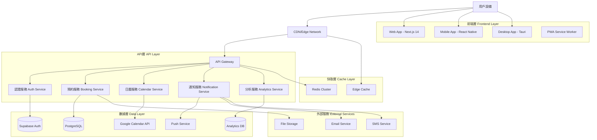
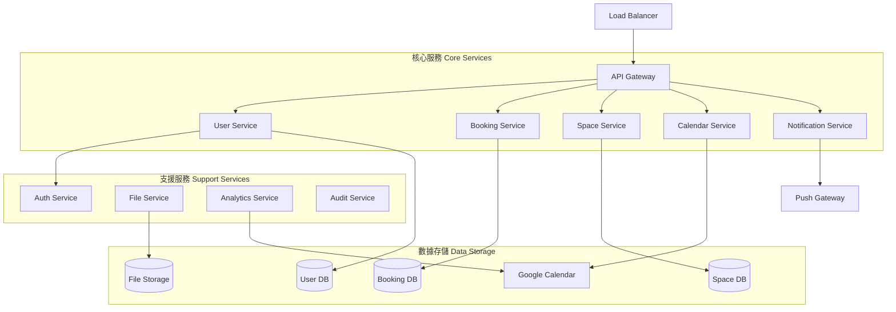
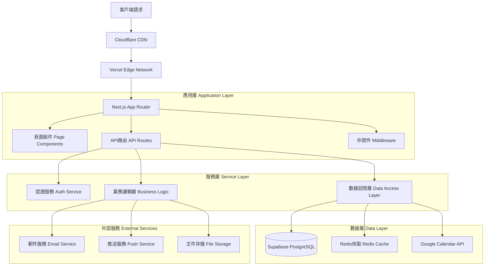
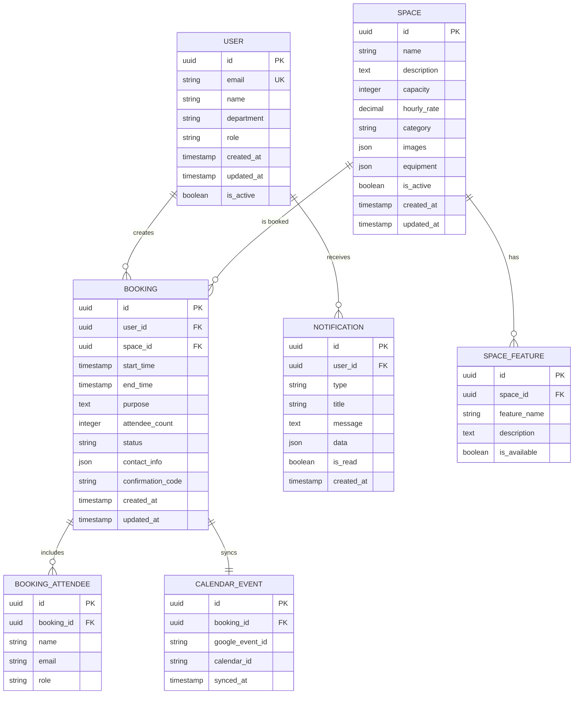

# 長庚大學創新育成中心空間預約系統 - 優化後技術架構文檔

## 1. 架構設計

### 1.1 整體架構圖



### 1.2 微服務架構圖



## 2. 技術描述

### 2.1 前端技術棧

#### Web應用
- **框架**: Next.js 14 + App Router
- **語言**: TypeScript 5.0+
- **狀態管理**: Zustand + React Query (TanStack Query)
- **UI框架**: Shadcn/ui + Tailwind CSS 3.4+
- **表單處理**: React Hook Form + Zod
- **動畫**: Framer Motion
- **測試**: Vitest + Testing Library + Playwright
- **構建工具**: Turbopack

#### 移動應用
- **框架**: React Native + Expo
- **導航**: React Navigation 6
- **狀態管理**: Zustand + React Query
- **UI組件**: NativeBase / Tamagui
- **推送通知**: Expo Notifications
- **本地存儲**: AsyncStorage + SQLite

#### 桌面應用
- **框架**: Tauri + React
- **後端**: Rust
- **前端**: React + TypeScript
- **狀態管理**: Zustand
- **系統整合**: Tauri APIs

### 2.2 後端技術棧

#### 主要服務
- **運行時**: Node.js 20+ / Deno (Edge Functions)
- **框架**: Fastify / Hono
- **數據庫**: Supabase (PostgreSQL)
- **ORM**: Prisma / Drizzle ORM
- **認證**: Supabase Auth
- **文件存儲**: Supabase Storage
- **快取**: Redis Cluster

#### 雲端服務
- **部署平台**: Vercel (前端) + Supabase (後端)
- **CDN**: Cloudflare
- **監控**: Sentry + Vercel Analytics
- **日誌**: Vercel Logs + Supabase Logs

## 3. 路由定義

### 3.1 Web應用路由

| 路由 | 用途 | 組件 |
|------|------|------|
| `/` | 首頁，空間列表和日曆 | HomePage |
| `/spaces` | 空間詳細列表 | SpacesPage |
| `/spaces/[id]` | 單一空間詳情 | SpaceDetailPage |
| `/booking/[id]` | 預約表單 | BookingPage |
| `/my-bookings` | 我的預約記錄 | MyBookingsPage |
| `/profile` | 用戶個人資料 | ProfilePage |
| `/admin` | 管理後台 | AdminDashboard |
| `/admin/spaces` | 空間管理 | SpaceManagement |
| `/admin/bookings` | 預約管理 | BookingManagement |
| `/admin/users` | 用戶管理 | UserManagement |
| `/admin/analytics` | 數據分析 | AnalyticsPage |
| `/login` | 登入頁面 | LoginPage |
| `/register` | 註冊頁面 | RegisterPage |
| `/forgot-password` | 忘記密碼 | ForgotPasswordPage |

### 3.2 移動應用導航

| 頁面 | 用途 |
|------|------|
| HomeStack | 首頁導航堆疊 |
| BookingStack | 預約相關頁面 |
| ProfileStack | 個人資料頁面 |
| SettingsStack | 設定頁面 |
| AuthStack | 認證相關頁面 |

## 4. API定義

### 4.1 認證相關API

#### 用戶註冊
```
POST /api/auth/register
```

**請求參數:**
| 參數名 | 類型 | 必填 | 描述 |
|--------|------|------|------|
| email | string | true | 用戶郵箱 |
| password | string | true | 密碼 |
| name | string | true | 用戶姓名 |
| department | string | true | 所屬單位 |

**回應:**
| 參數名 | 類型 | 描述 |
|--------|------|------|
| success | boolean | 註冊是否成功 |
| user | object | 用戶資訊 |
| token | string | JWT令牌 |

#### 用戶登入
```
POST /api/auth/login
```

**請求參數:**
| 參數名 | 類型 | 必填 | 描述 |
|--------|------|------|------|
| email | string | true | 用戶郵箱 |
| password | string | true | 密碼 |

**回應:**
| 參數名 | 類型 | 描述 |
|--------|------|------|
| success | boolean | 登入是否成功 |
| user | object | 用戶資訊 |
| token | string | JWT令牌 |

### 4.2 空間管理API

#### 獲取空間列表
```
GET /api/spaces
```

**查詢參數:**
| 參數名 | 類型 | 必填 | 描述 |
|--------|------|------|------|
| page | number | false | 頁碼 |
| limit | number | false | 每頁數量 |
| category | string | false | 空間類別 |

**回應:**
| 參數名 | 類型 | 描述 |
|--------|------|------|
| spaces | array | 空間列表 |
| total | number | 總數量 |
| page | number | 當前頁碼 |

#### 獲取空間詳情
```
GET /api/spaces/[id]
```

**回應:**
| 參數名 | 類型 | 描述 |
|--------|------|------|
| id | string | 空間ID |
| name | string | 空間名稱 |
| description | string | 空間描述 |
| capacity | number | 容納人數 |
| features | array | 設備特色 |
| images | array | 空間圖片 |
| availability | object | 可用時段 |

### 4.3 預約管理API

#### 創建預約
```
POST /api/bookings
```

**請求參數:**
| 參數名 | 類型 | 必填 | 描述 |
|--------|------|------|------|
| spaceId | string | true | 空間ID |
| startTime | string | true | 開始時間 (ISO 8601) |
| endTime | string | true | 結束時間 (ISO 8601) |
| purpose | string | true | 使用目的 |
| attendees | number | true | 參與人數 |
| contactInfo | object | true | 聯絡資訊 |

**回應:**
| 參數名 | 類型 | 描述 |
|--------|------|------|
| success | boolean | 預約是否成功 |
| bookingId | string | 預約ID |
| confirmationCode | string | 確認碼 |

#### 獲取預約列表
```
GET /api/bookings
```

**查詢參數:**
| 參數名 | 類型 | 必填 | 描述 |
|--------|------|------|------|
| userId | string | false | 用戶ID (管理員可查看所有) |
| spaceId | string | false | 空間ID |
| startDate | string | false | 開始日期 |
| endDate | string | false | 結束日期 |
| status | string | false | 預約狀態 |

### 4.4 日曆整合API

#### 獲取日曆事件
```
GET /api/calendar/events
```

**查詢參數:**
| 參數名 | 類型 | 必填 | 描述 |
|--------|------|------|------|
| timeMin | string | true | 開始時間 (ISO 8601) |
| timeMax | string | true | 結束時間 (ISO 8601) |
| spaceId | string | false | 空間ID篩選 |

**回應:**
| 參數名 | 類型 | 描述 |
|--------|------|------|
| events | array | 事件列表 |
| nextPageToken | string | 下一頁令牌 |

### 4.5 通知API

#### 發送通知
```
POST /api/notifications
```

**請求參數:**
| 參數名 | 類型 | 必填 | 描述 |
|--------|------|------|------|
| userId | string | true | 接收用戶ID |
| type | string | true | 通知類型 |
| title | string | true | 通知標題 |
| message | string | true | 通知內容 |
| data | object | false | 額外數據 |

## 5. 服務器架構圖



## 6. 數據模型

### 6.1 數據模型定義



### 6.2 數據定義語言 (DDL)

#### 用戶表 (users)
```sql
-- 創建用戶表
CREATE TABLE users (
    id UUID PRIMARY KEY DEFAULT gen_random_uuid(),
    email VARCHAR(255) UNIQUE NOT NULL,
    name VARCHAR(100) NOT NULL,
    department VARCHAR(100),
    role VARCHAR(20) DEFAULT 'user' CHECK (role IN ('user', 'admin', 'manager')),
    avatar_url TEXT,
    phone VARCHAR(20),
    is_active BOOLEAN DEFAULT true,
    created_at TIMESTAMP WITH TIME ZONE DEFAULT NOW(),
    updated_at TIMESTAMP WITH TIME ZONE DEFAULT NOW()
);

-- 創建索引
CREATE INDEX idx_users_email ON users(email);
CREATE INDEX idx_users_department ON users(department);
CREATE INDEX idx_users_role ON users(role);

-- 設置RLS (Row Level Security)
ALTER TABLE users ENABLE ROW LEVEL SECURITY;

-- 創建策略
CREATE POLICY "Users can view own profile" ON users
    FOR SELECT USING (auth.uid() = id);

CREATE POLICY "Users can update own profile" ON users
    FOR UPDATE USING (auth.uid() = id);
```

#### 空間表 (spaces)
```sql
-- 創建空間表
CREATE TABLE spaces (
    id UUID PRIMARY KEY DEFAULT gen_random_uuid(),
    name VARCHAR(100) NOT NULL,
    description TEXT,
    capacity INTEGER NOT NULL CHECK (capacity > 0),
    hourly_rate DECIMAL(10,2) DEFAULT 0,
    category VARCHAR(50),
    images JSONB DEFAULT '[]',
    equipment JSONB DEFAULT '[]',
    location TEXT,
    is_active BOOLEAN DEFAULT true,
    created_at TIMESTAMP WITH TIME ZONE DEFAULT NOW(),
    updated_at TIMESTAMP WITH TIME ZONE DEFAULT NOW()
);

-- 創建索引
CREATE INDEX idx_spaces_category ON spaces(category);
CREATE INDEX idx_spaces_capacity ON spaces(capacity);
CREATE INDEX idx_spaces_active ON spaces(is_active);

-- 設置RLS
ALTER TABLE spaces ENABLE ROW LEVEL SECURITY;

-- 創建策略
CREATE POLICY "Spaces are viewable by everyone" ON spaces
    FOR SELECT USING (is_active = true);

CREATE POLICY "Only admins can modify spaces" ON spaces
    FOR ALL USING (
        EXISTS (
            SELECT 1 FROM users 
            WHERE users.id = auth.uid() 
            AND users.role IN ('admin', 'manager')
        )
    );
```

#### 預約表 (bookings)
```sql
-- 創建預約表
CREATE TABLE bookings (
    id UUID PRIMARY KEY DEFAULT gen_random_uuid(),
    user_id UUID REFERENCES users(id) ON DELETE CASCADE,
    space_id UUID REFERENCES spaces(id) ON DELETE CASCADE,
    start_time TIMESTAMP WITH TIME ZONE NOT NULL,
    end_time TIMESTAMP WITH TIME ZONE NOT NULL,
    purpose TEXT NOT NULL,
    attendee_count INTEGER DEFAULT 1 CHECK (attendee_count > 0),
    status VARCHAR(20) DEFAULT 'pending' CHECK (status IN ('pending', 'confirmed', 'cancelled', 'completed')),
    contact_info JSONB NOT NULL,
    confirmation_code VARCHAR(10) UNIQUE,
    notes TEXT,
    created_at TIMESTAMP WITH TIME ZONE DEFAULT NOW(),
    updated_at TIMESTAMP WITH TIME ZONE DEFAULT NOW(),
    
    -- 確保結束時間晚於開始時間
    CONSTRAINT valid_time_range CHECK (end_time > start_time),
    
    -- 確保參與人數不超過空間容量
    CONSTRAINT valid_attendee_count CHECK (
        attendee_count <= (SELECT capacity FROM spaces WHERE id = space_id)
    )
);

-- 創建索引
CREATE INDEX idx_bookings_user_id ON bookings(user_id);
CREATE INDEX idx_bookings_space_id ON bookings(space_id);
CREATE INDEX idx_bookings_start_time ON bookings(start_time);
CREATE INDEX idx_bookings_status ON bookings(status);
CREATE INDEX idx_bookings_confirmation_code ON bookings(confirmation_code);

-- 創建複合索引用於時間衝突檢查
CREATE INDEX idx_bookings_space_time ON bookings(space_id, start_time, end_time)
    WHERE status IN ('pending', 'confirmed');

-- 設置RLS
ALTER TABLE bookings ENABLE ROW LEVEL SECURITY;

-- 創建策略
CREATE POLICY "Users can view own bookings" ON bookings
    FOR SELECT USING (auth.uid() = user_id);

CREATE POLICY "Users can create bookings" ON bookings
    FOR INSERT WITH CHECK (auth.uid() = user_id);

CREATE POLICY "Users can update own bookings" ON bookings
    FOR UPDATE USING (auth.uid() = user_id);

CREATE POLICY "Admins can view all bookings" ON bookings
    FOR SELECT USING (
        EXISTS (
            SELECT 1 FROM users 
            WHERE users.id = auth.uid() 
            AND users.role IN ('admin', 'manager')
        )
    );
```

#### 通知表 (notifications)
```sql
-- 創建通知表
CREATE TABLE notifications (
    id UUID PRIMARY KEY DEFAULT gen_random_uuid(),
    user_id UUID REFERENCES users(id) ON DELETE CASCADE,
    type VARCHAR(50) NOT NULL,
    title VARCHAR(200) NOT NULL,
    message TEXT NOT NULL,
    data JSONB DEFAULT '{}',
    is_read BOOLEAN DEFAULT false,
    created_at TIMESTAMP WITH TIME ZONE DEFAULT NOW()
);

-- 創建索引
CREATE INDEX idx_notifications_user_id ON notifications(user_id);
CREATE INDEX idx_notifications_type ON notifications(type);
CREATE INDEX idx_notifications_is_read ON notifications(is_read);
CREATE INDEX idx_notifications_created_at ON notifications(created_at DESC);

-- 設置RLS
ALTER TABLE notifications ENABLE ROW LEVEL SECURITY;

-- 創建策略
CREATE POLICY "Users can view own notifications" ON notifications
    FOR SELECT USING (auth.uid() = user_id);

CREATE POLICY "Users can update own notifications" ON notifications
    FOR UPDATE USING (auth.uid() = user_id);
```

#### 初始數據
```sql
-- 插入預設空間數據
INSERT INTO spaces (name, description, capacity, hourly_rate, category, equipment, location) VALUES
('創新發想基地', '適合團隊討論和創意發想的空間，配備投影設備和白板', 20, 500, 'meeting', '["投影設備", "白板", "WiFi", "空調"]', '1樓'),
('共創空間', '開放式工作空間，適合小組討論和協作', 15, 400, 'coworking', '["WiFi", "電源插座", "空調"]', '2樓'),
('小會議室', '私密會議空間，適合小型會議和討論', 8, 300, 'meeting', '["投影設備", "WiFi", "空調"]', '3樓'),
('多功能會議室', '多功能會議空間，可根據需求調整配置', 25, 600, 'conference', '["投影設備", "音響系統", "WiFi", "空調"]', '4樓'),
('DEMO ROOM', '展示空間，適合產品展示和演示活動', 30, 800, 'presentation', '["投影設備", "音響系統", "WiFi", "空調", "展示櫃"]', '5樓');

-- 創建管理員用戶 (需要在應用層處理密碼雜湊)
INSERT INTO users (email, name, department, role) VALUES
('admin@cgu.edu.tw', '系統管理員', '技術合作處', 'admin'),
('manager@cgu.edu.tw', '空間管理員', '創新育成中心', 'manager');
```

#### 觸發器和函數
```sql
-- 創建更新時間戳的函數
CREATE OR REPLACE FUNCTION update_updated_at_column()
RETURNS TRIGGER AS $$
BEGIN
    NEW.updated_at = NOW();
    RETURN NEW;
END;
$$ language 'plpgsql';

-- 為相關表創建觸發器
CREATE TRIGGER update_users_updated_at BEFORE UPDATE ON users
    FOR EACH ROW EXECUTE FUNCTION update_updated_at_column();

CREATE TRIGGER update_spaces_updated_at BEFORE UPDATE ON spaces
    FOR EACH ROW EXECUTE FUNCTION update_updated_at_column();

CREATE TRIGGER update_bookings_updated_at BEFORE UPDATE ON bookings
    FOR EACH ROW EXECUTE FUNCTION update_updated_at_column();

-- 創建確認碼生成函數
CREATE OR REPLACE FUNCTION generate_confirmation_code()
RETURNS TRIGGER AS $$
BEGIN
    NEW.confirmation_code = UPPER(SUBSTRING(MD5(RANDOM()::TEXT) FROM 1 FOR 8));
    RETURN NEW;
END;
$$ language 'plpgsql';

-- 為預約表創建確認碼生成觸發器
CREATE TRIGGER generate_booking_confirmation_code BEFORE INSERT ON bookings
    FOR EACH ROW EXECUTE FUNCTION generate_confirmation_code();
```

## 7. 安全性配置

### 7.1 認證和授權
- **JWT令牌** - 無狀態認證
- **角色基礎訪問控制** - 用戶/管理員/經理角色
- **行級安全性** - Supabase RLS策略
- **API速率限制** - 防止濫用

### 7.2 數據保護
- **數據加密** - 傳輸和靜態加密
- **輸入驗證** - Zod模式驗證
- **SQL注入防護** - 參數化查詢
- **XSS防護** - 內容安全策略

### 7.3 隱私保護
- **GDPR合規** - 數據處理透明度
- **數據最小化** - 只收集必要數據
- **用戶同意** - 明確的隱私政策
- **數據刪除** - 用戶數據刪除權利

---

*此技術架構文檔詳細描述了優化後的長庚大學創新育成中心空間預約系統的完整技術實現方案，包含現代化的多平台架構、微服務設計、數據模型和安全性配置。*