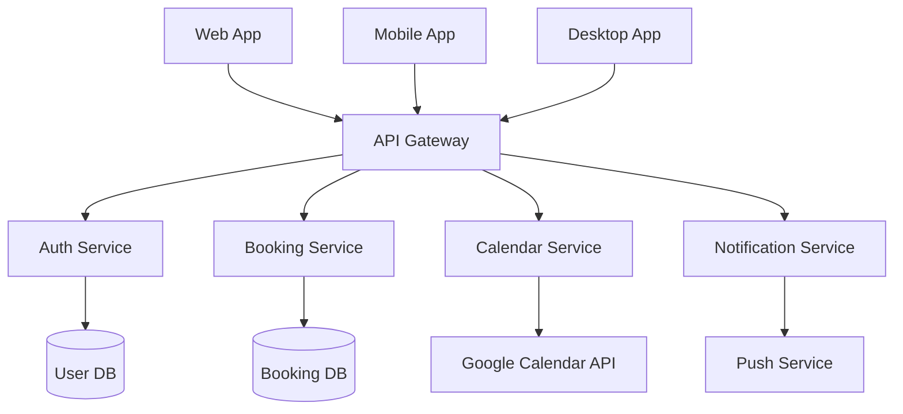

# 長庚大學創新育成中心空間預約系統 - 技術優化建議書

## 1. 當前技術棧分析

### 1.1 現有架構優點
- **Next.js 15.2.4** - 提供優秀的SSR/SSG能力和開發體驗
- **TypeScript** - 強型別檢查，提升代碼品質
- **Tailwind CSS** - 快速UI開發，一致性設計
- **Google Calendar API** - 成熟的日曆整合方案
- **Netlify部署** - 簡單的CI/CD流程

### 1.2 現有架構限制
- **單一平台** - 僅支援Web端，缺乏移動端原生體驗
- **傳統架構** - 缺乏微服務架構的擴展性
- **有限的離線功能** - 無PWA支援
- **性能瓶頸** - 缺乏現代化的狀態管理和快取策略
- **用戶體驗** - 缺乏即時通知和推送功能

## 2. 多平台技術選型建議

### 2.1 跨平台框架選擇

#### 推薦方案：React Native + Expo
- **優勢**：
  - 代碼復用率高（70-80%）
  - 豐富的生態系統
  - 原生性能體驗
  - 支援OTA更新
- **適用場景**：iOS/Android移動應用

#### 備選方案：Flutter
- **優勢**：
  - 單一代碼庫支援多平台
  - 優秀的UI性能
  - Google支援的成熟框架
- **考量**：需要學習Dart語言

### 2.2 桌面應用解決方案

#### 推薦方案：Tauri
- **優勢**：
  - 輕量級（相比Electron）
  - 安全性更高
  - 更好的性能表現
  - Rust後端 + Web前端

#### 備選方案：Electron
- **優勢**：
  - 成熟的生態系統
  - 豐富的API支援
  - 快速開發

### 2.3 Web端現代化

#### 推薦升級：Next.js 14 + App Router
- **新特性**：
  - Server Components
  - 改進的快取策略
  - 更好的SEO支援
  - 內建圖片優化

## 3. 最新技術整合方案

### 3.1 前端技術棧升級

```typescript
// 推薦技術棧
{
  "framework": "Next.js 14 + App Router",
  "state_management": "Zustand + React Query",
  "ui_library": "Shadcn/ui + Tailwind CSS",
  "animation": "Framer Motion",
  "forms": "React Hook Form + Zod",
  "testing": "Vitest + Testing Library",
  "bundler": "Turbopack"
}
```

### 3.2 PWA實現
- **Service Worker** - 離線功能支援
- **Web Push** - 即時通知
- **App Shell** - 快速載入體驗
- **Background Sync** - 離線數據同步

### 3.3 微服務架構



## 4. 雲端服務優化

### 4.1 推薦雲端平台：Vercel + Supabase

#### Vercel優勢
- **Edge Functions** - 全球分佈式計算
- **自動擴展** - 無需手動配置
- **內建分析** - 性能監控
- **零配置部署** - 與Next.js完美整合

#### Supabase優勢
- **即時數據庫** - PostgreSQL + 即時訂閱
- **內建認證** - 多種登入方式
- **邊緣函數** - Deno運行時
- **對象存儲** - 文件管理

### 4.2 備選方案：AWS Amplify
- **全棧解決方案** - 前後端一體化
- **GraphQL API** - 自動生成
- **機器學習整合** - AI功能擴展

### 4.3 CDN和快取策略
- **Cloudflare** - 全球CDN加速
- **Redis** - 分佈式快取
- **Edge Caching** - 邊緣節點快取

## 5. 性能優化策略

### 5.1 前端性能優化

#### 代碼分割和懶載入
```typescript
// 動態導入組件
const BookingForm = lazy(() => import('./components/BookingForm'));
const Calendar = lazy(() => import('./components/Calendar'));

// 路由級別代碼分割
const BookingPage = lazy(() => import('./pages/BookingPage'));
```

#### 圖片優化
- **Next.js Image** - 自動優化和WebP轉換
- **響應式圖片** - 不同設備尺寸適配
- **懶載入** - 視窗內載入

### 5.2 數據庫優化
- **索引優化** - 查詢性能提升
- **連接池** - 數據庫連接管理
- **讀寫分離** - 負載分散
- **數據快取** - Redis快取層

### 5.3 API優化
- **GraphQL** - 精確數據查詢
- **數據預載** - 減少請求次數
- **壓縮** - Gzip/Brotli壓縮
- **HTTP/2** - 多路復用

## 6. 用戶體驗提升方案

### 6.1 即時功能
- **WebSocket** - 即時預約狀態更新
- **Server-Sent Events** - 單向即時通知
- **樂觀更新** - 即時UI反饋

### 6.2 離線支援
- **Service Worker** - 離線快取
- **IndexedDB** - 本地數據存儲
- **Background Sync** - 網路恢復後同步

### 6.3 無障礙設計
- **ARIA標籤** - 螢幕閱讀器支援
- **鍵盤導航** - 完整鍵盤操作
- **色彩對比** - WCAG 2.1 AA標準

### 6.4 國際化支援
- **i18next** - 多語言支援
- **時區處理** - 自動時區轉換
- **本地化格式** - 日期、時間、貨幣格式

## 7. 開發效率改進建議

### 7.1 開發工具鏈

#### 推薦工具配置
```json
{
  "package_manager": "pnpm",
  "bundler": "Turbopack",
  "linter": "ESLint + Prettier",
  "type_checker": "TypeScript 5.0+",
  "testing": "Vitest + Playwright",
  "ci_cd": "GitHub Actions",
  "monitoring": "Sentry + Vercel Analytics"
}
```

### 7.2 代碼品質保證
- **Husky** - Git hooks
- **lint-staged** - 提交前檢查
- **Conventional Commits** - 標準化提交訊息
- **Semantic Release** - 自動版本發布

### 7.3 開發流程優化
- **Monorepo** - 統一代碼管理（Nx/Turborepo）
- **Component Library** - 可復用組件庫
- **Design System** - 統一設計規範
- **Storybook** - 組件文檔和測試

### 7.4 自動化測試
```typescript
// 測試策略
{
  "unit_tests": "Vitest + Testing Library",
  "integration_tests": "Playwright",
  "e2e_tests": "Cypress/Playwright",
  "visual_tests": "Chromatic",
  "performance_tests": "Lighthouse CI"
}
```

## 8. 實施路線圖

### 階段一：基礎優化（1-2個月）
1. 升級到Next.js 14 + App Router
2. 實施PWA功能
3. 整合Supabase後端
4. 添加即時通知功能

### 階段二：多平台擴展（2-3個月）
1. 開發React Native移動應用
2. 實施Tauri桌面應用
3. 微服務架構重構
4. 性能優化實施

### 階段三：高級功能（1-2個月）
1. AI智能推薦系統
2. 高級分析和報表
3. 第三方系統整合
4. 安全性增強

## 9. 預期效益

### 9.1 技術效益
- **性能提升** - 載入速度提升50%+
- **開發效率** - 代碼復用率提升70%+
- **維護成本** - 降低40%+
- **擴展性** - 支援10x用戶增長

### 9.2 用戶體驗效益
- **多平台支援** - 覆蓋Web/Mobile/Desktop
- **離線功能** - 無網路環境下基本操作
- **即時更新** - 預約狀態即時同步
- **個性化體驗** - AI推薦和智能提醒

### 9.3 業務效益
- **用戶滿意度** - 提升用戶體驗評分
- **運營效率** - 自動化管理流程
- **數據洞察** - 詳細的使用分析
- **競爭優勢** - 技術領先地位

## 10. 風險評估與緩解

### 10.1 技術風險
- **學習曲線** - 團隊技術培訓
- **相容性問題** - 充分測試和漸進式升級
- **性能回歸** - 持續監控和優化

### 10.2 業務風險
- **服務中斷** - 藍綠部署策略
- **數據遷移** - 完整的備份和回滾計劃
- **用戶適應** - 漸進式功能發布

### 10.3 緩解策略
- **分階段實施** - 降低單次變更風險
- **A/B測試** - 驗證新功能效果
- **監控告警** - 及時發現和處理問題
- **文檔完善** - 確保知識傳承

---

*本技術優化建議書基於當前最新的Web開發技術和最佳實踐，旨在將長庚大學創新育成中心空間預約系統打造成為現代化、高性能、多平台的解決方案。*